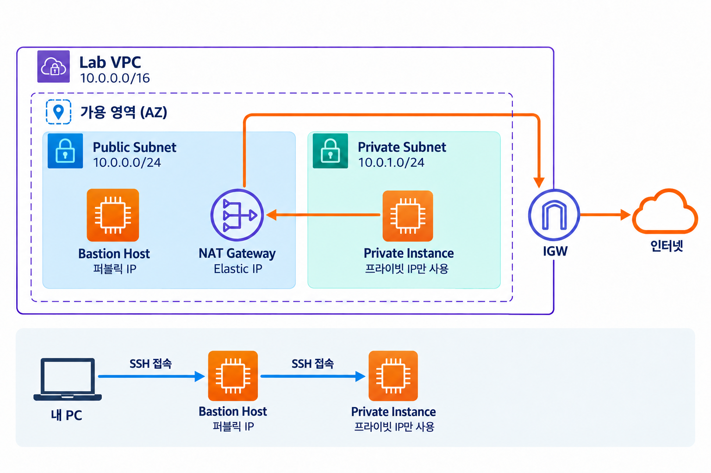
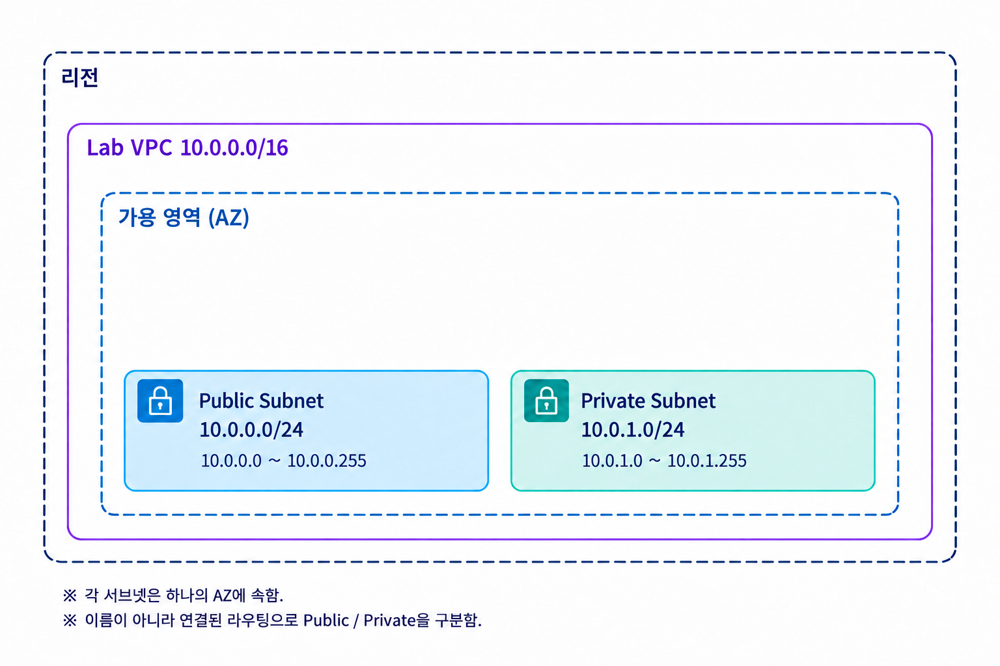
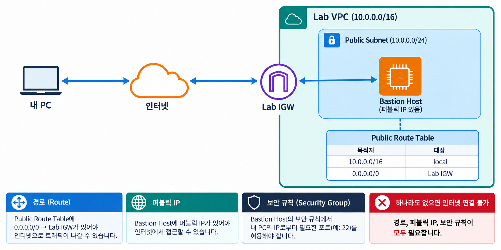
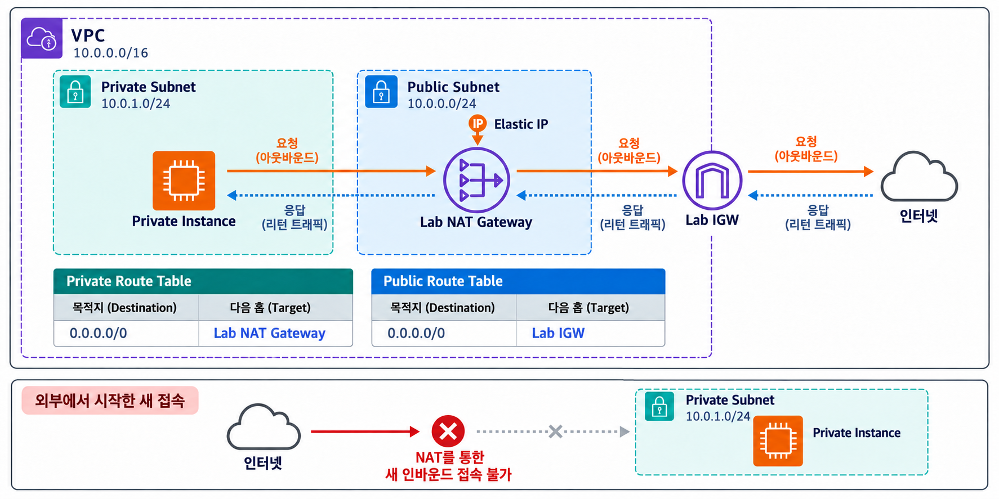
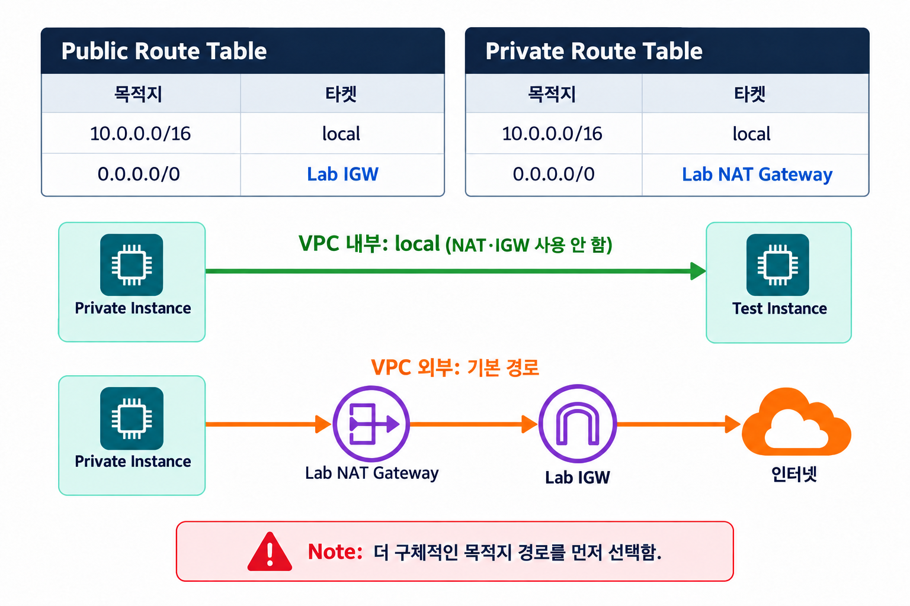
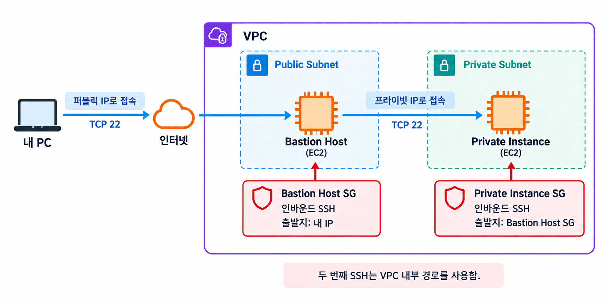
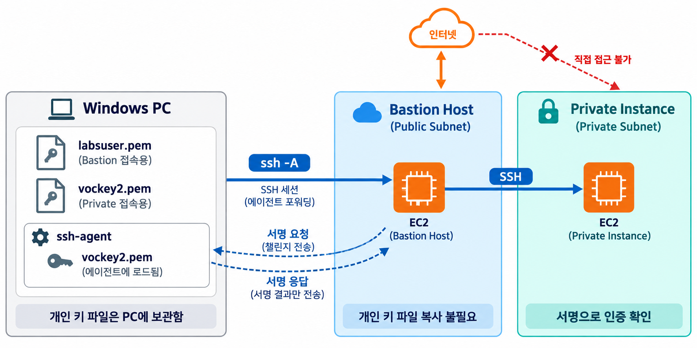
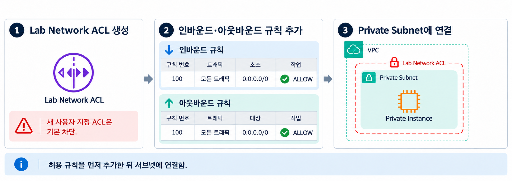
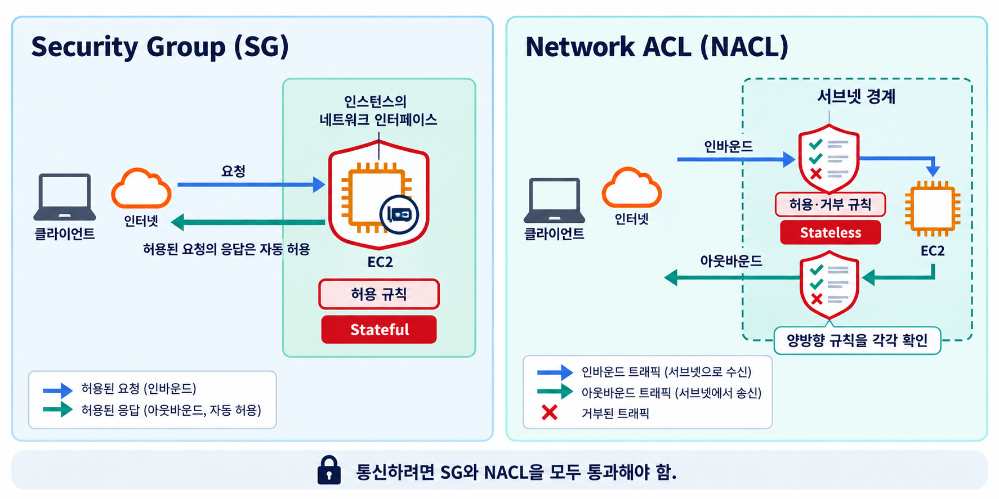
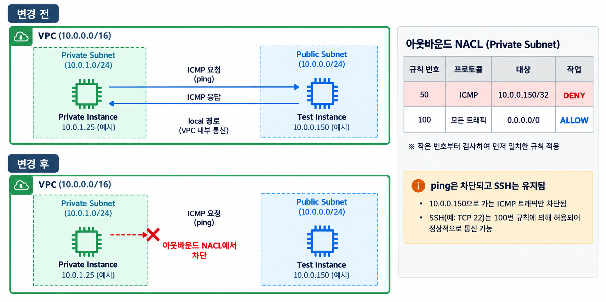

# 챌린지 랩: 카페를 위한 VPC 네트워킹 환경 구축

> **수업용 따라하기 튜토리얼**
>
> 이 문서는 AWS Academy 챌린지 랩의 원래 흐름을 유지하면서, 학생이 위에서부터 그대로 따라 할 수 있도록
> AWS Console 이동 경로, 확인 포인트, Windows OpenSSH 사용 방법을 보강한 실습 가이드입니다.
>
> 특히 최신 AWS Console에서 서브넷 생성 시 표시되는 **가용성 모드**는 반드시 **`영역별`**을 선택합니다.

---

## 0. 실습 목표

이번 실습에서는 Amazon VPC를 이용하여 다음 네트워크 환경을 구성합니다.

- 인터넷에 연결되는 **Public Subnet** 생성
- Public Subnet에 **Bastion Host** 배치
- 인터넷에서 직접 접근할 수 없는 **Private Subnet** 생성
- **NAT Gateway**를 이용하여 Private Instance가 인터넷으로 나갈 수 있도록 구성
- Bastion Host를 거쳐 Private Instance에 SSH 접속
- **Security Group**으로 EC2 단위 접근 제어
- **Network ACL**로 Subnet 단위 접근 제어

---

## 1. 최종 아키텍처

실습 완료 후 다음과 비슷한 구조가 됩니다.



### 관리자가 Private Instance에 접속하는 경로

내 PC → Bastion Host의 퍼블릭 IP → Private Instance의 프라이빗 IP 순서로 SSH 접속함.

### Private Instance가 인터넷으로 나가는 경로

Private Instance → NAT Gateway → Internet Gateway → 인터넷 순서로 통신함. 응답은 반대 경로로 돌아옴.

---

## 2. 실습에서 사용할 주요 설정값

| 항목 | 값 |
|---|---|
| VPC | `Lab VPC` |
| Public Subnet | `10.0.0.0/24` |
| Private Subnet | `10.0.1.0/24` |
| Bastion Host | Amazon Linux 2023 / `t2.micro` |
| Private Instance | Amazon Linux 2023 / `t2.micro` |
| Test Instance | Amazon Linux 2023 / `t2.micro` |
| Bastion Key | `vockey` / 다운로드 파일 `labsuser.pem` |
| Private Instance Key | `vockey2` |
| Bastion SG | `Bastion Host SG` |
| Private SG | `Private Instance SG` |
| Test SG | `Test SG` |
| NAT Gateway | `Lab NAT Gateway` |
| Private Route Table | `Private Route Table` |
| Network ACL | `Lab Network ACL` |

> **주의**
>
> 실제 Public IP, Public DNS, Private IP, AZ 이름은 랩을 실행할 때마다 달라질 수 있습니다.
> 문서의 예시 주소를 그대로 입력하지 말고 **자신의 AWS Console에 표시된 값**을 사용합니다.

---

# 3. AWS Lab 시작

1. 실습 페이지 상단의 **Start Lab**을 클릭합니다.
2. 랩 세션이 시작될 때까지 기다립니다.
3. 왼쪽 위의 AWS 상태 아이콘이 **녹색**으로 바뀌었는지 확인합니다.
4. **AWS** 링크를 클릭합니다.
5. 새 브라우저 탭에서 AWS Management Console이 열리는지 확인합니다.

> **권장**
>
> 왼쪽에는 실습 가이드, 오른쪽에는 AWS Console을 배치하면 실습하기 편합니다.

---

# Challenge 1. Bastion Host를 이용하여 Private Instance에 안전하게 연결하기

첫 번째 Challenge에서는 다음 구조를 만듭니다.

내 PC → Bastion Host의 퍼블릭 IP → Private Instance의 프라이빗 IP 순서로 SSH 접속함.

또한 Private Instance가 Public IP 없이도 NAT Gateway를 통해 인터넷으로 나갈 수 있도록 구성합니다.

---

# 태스크 1. Public Subnet 생성

## 1-1. VPC Console 열기

AWS Console 상단 검색창에 다음을 입력합니다.

```text
VPC
```

VPC Console에서 다음으로 이동합니다.

**Subnets → Create subnet**

---

## 1-2. VPC 선택

다음과 같이 선택합니다.

| 항목 | 값 |
|---|---|
| VPC ID | `Lab VPC` |

---

## 1-3. 가용성 모드 선택 — 매우 중요

최신 AWS Console에서 **가용성 모드**가 표시되면 반드시 다음을 선택합니다.

```text
● 영역별
```

다음 옵션은 선택하지 않습니다.

```text
○ 리전별 - 신규
```

화면에서는 다음과 비슷하게 표시됩니다.

```text
가용성 모드

○ 리전별 - 신규
   모든 리전 내 가용 영역(AZ)에 자동으로 확장

● 영역별
   특정 가용 영역 내에서 세분화된 제어 제공
```

> [!IMPORTANT]
> 이번 실습에서는 **Public Subnet과 Private Subnet 모두 `영역별`로 생성**합니다.
>
> `리전별 - 신규`를 선택하면 이 실습에서 요구하는 특정 Availability Zone과 CIDR을 직접 지정하는 방식과 맞지 않아
> 생성이 정상적으로 진행되지 않을 수 있습니다.

---

## 1-4. Public Subnet 정보 입력

다음과 같이 설정합니다.

| 항목 | 값 |
|---|---|
| Subnet name | `Public Subnet` |
| Availability Zone | 현재 Region의 `a` 영역 |
| IPv4 subnet CIDR block | `10.0.0.0/24` |

예를 들어 현재 Region이 `us-east-1`이면 다음과 같습니다.

```text
Availability Zone
→ us-east-1a
```

이번 실습에서는 아래처럼 같은 AZ에 두 서브넷을 구성함. 지금은 Public Subnet을 만들고, Private Subnet은 태스크 4에서 추가함.



설정 후 **Create subnet**을 클릭합니다.

### ✅ 확인

Subnet 목록에서 다음 항목이 보이는지 확인합니다.

```text
Public Subnet
10.0.0.0/24
Availability Zone: ...a
```

---

# 태스크 1-2. Internet Gateway 생성

Public Subnet을 만들었다고 해서 자동으로 인터넷과 통신할 수 있는 것은 아닙니다.

VPC를 인터넷과 연결하는 **Internet Gateway(IGW)**가 필요합니다.

## 1-5. Internet Gateway 생성

VPC Console 왼쪽 메뉴에서 다음으로 이동합니다.

**Internet Gateways → Create internet gateway**

이름:

```text
Lab IGW
```

**Create internet gateway**를 클릭합니다.

---

## 1-6. Lab VPC에 Internet Gateway 연결

생성한 `Lab IGW`를 선택합니다.

**Actions → Attach to a VPC**

를 선택합니다.

VPC:

```text
Lab VPC
```

**Attach internet gateway**를 클릭합니다.

---

# 태스크 1-3. Public Route 설정

Internet Gateway를 VPC에 연결했더라도 Route Table에 경로가 없으면 인터넷 방향으로 패킷을 전달할 수 없습니다.

다음 경로를 추가합니다.

```text
0.0.0.0/0 → Internet Gateway
```

`0.0.0.0/0`은 특정 네트워크가 아닌 **모든 IPv4 목적지**를 의미합니다.

---

## 1-7. Route Table 확인

VPC Console에서 다음으로 이동합니다.

**Route Tables**

`Lab VPC`에 속한 Route Table을 선택합니다.

필요하면 Name을 다음과 같이 지정합니다.

```text
Public Route Table
```

---

## 1-8. 기본 경로 추가

선택한 Route Table에서 다음으로 이동합니다.

**Routes → Edit routes → Add route**

다음을 추가합니다.

| Destination | Target |
|---|---|
| `0.0.0.0/0` | 생성한 `Lab IGW` |

저장합니다.

최종적으로 다음과 비슷한 Route가 보이면 됩니다.

Public Route Table: `10.0.0.0/16 → local`, `0.0.0.0/0 → Lab IGW`임.

> `local` Route는 VPC 내부 통신을 위해 AWS가 자동으로 제공하는 경로입니다.

---

## 1-9. Public Subnet과 Route Table 연결 확인

선택한 Route Table에서

**Subnet associations**

를 확인합니다.

`Public Subnet`이 연결되어 있지 않다면

**Edit subnet associations**

를 선택합니다.

다음을 체크합니다.

```text
Public Subnet
```

저장합니다.

### ✅ 태스크 1 완료

이 경로에 다음 태스크에서 만들 Bastion Host를 배치하면 아래와 같이 통신함.



---

# 태스크 2. Bastion Host 생성

이번에는 Public Subnet에 **Bastion Host**를 생성합니다.

Bastion Host는 외부에서 Private Network로 들어가기 위한 중간 접속 서버입니다.

내 PC → Bastion Host의 퍼블릭 IP → Private Instance의 프라이빗 IP 순서로 SSH 접속함.

---

## 2-1. EC2 Instance 생성

AWS Console에서 다음으로 이동합니다.

**EC2 → Instances → Launch instances**

다음과 같이 설정합니다.

| 항목 | 값 |
|---|---|
| Name | `Bastion Host` |
| AMI | Amazon Linux 2023 |
| Instance type | `t2.micro` |
| Key pair | `vockey` |

---

## 2-2. Network 설정

**Network settings → Edit**

을 클릭합니다.

다음과 같이 설정합니다.

| 항목 | 값 |
|---|---|
| VPC | `Lab VPC` |
| Subnet | `Public Subnet` |
| Auto-assign public IP | `Enable` |

Bastion Host는 내 PC에서 직접 접속해야 하므로 Public IP가 필요합니다.

---

## 2-3. Bastion Host Security Group 생성

새 Security Group을 생성합니다.

Security Group name:

```text
Bastion Host SG
```

Inbound Rule:

| Type | Port | Source |
|---|---:|---|
| SSH | 22 | My IP |

> [!IMPORTANT]
> `0.0.0.0/0` 대신 **My IP**를 사용합니다.
>
> 이렇게 하면 인터넷 전체가 아니라 현재 사용 중인 공인 IP에서만 SSH 접속을 시도할 수 있습니다.

설정을 완료한 후 **Launch instance**를 클릭합니다.

---

## 2-4. Instance 상태 확인

EC2 목록에서 `Bastion Host`가 다음 상태가 될 때까지 기다립니다.

```text
Running
```

가능하면 Status check도 정상 상태가 될 때까지 기다립니다.

---

# 태스크 3. Bastion Host 연결 테스트

이번 태스크에서는 내 Windows PC에서 Bastion Host까지 SSH 연결이 가능한지 확인합니다.

내 PC에서 `labsuser.pem`으로 Bastion Host의 퍼블릭 주소에 SSH 접속함.

이 튜토리얼에서는 Windows의 **기본 OpenSSH `ssh` 명령**을 사용합니다.

---

## 3-1. SSH Private Key 다운로드

실습 페이지 오른쪽 위에서

**AWS Details**

를 선택합니다.

Windows OpenSSH를 사용할 것이므로 **Download PEM**을 선택합니다.

다운로드된 파일 이름은 다음과 비슷합니다.

```text
labsuser.pem
```

> 파일 이름은 랩 환경에 따라 약간 다를 수 있습니다.
> 실제로 다운로드된 `.pem` 파일 이름을 확인합니다.

---

## 3-2. PEM 파일이 있는 폴더에서 CMD 열기

Windows 탐색기에서 `labsuser.pem` 파일이 있는 폴더를 엽니다.

탐색기 주소창에 다음을 입력하고 Enter를 누릅니다.

```text
cmd
```

현재 폴더를 작업 경로로 사용하는 명령 프롬프트가 열립니다.

---

## 3-3. PEM 파일 권한 설정

Windows OpenSSH는 Private Key 파일을 다른 사용자도 읽을 수 있는 상태로 두면 사용을 거부할 수 있습니다.

다음과 같은 오류가 나타날 수 있습니다.

```text
WARNING: UNPROTECTED PRIVATE KEY FILE!
Permissions for 'labsuser.pem' are too open.
This private key will be ignored.
Load key "labsuser.pem": bad permissions
```

이 경우 CMD에서 다음 명령을 **순서대로 실행**합니다.

```cmd
icacls "labsuser.pem" /inheritance:r
icacls "labsuser.pem" /remove:g "Users" "Authenticated Users" "Everyone"
icacls "labsuser.pem" /grant:r "%USERNAME%:R"
```

각 명령의 의미는 다음과 같습니다.

```text
/inheritance:r
→ 상위 폴더에서 상속된 권한 제거

/remove:g
→ 일반 사용자 그룹에 부여된 권한 제거

/grant:r "%USERNAME%:R"
→ 현재 사용자에게 읽기(Read) 권한 부여
```

즉 다음과 같은 상태를 만드는 것입니다.

개인 키 파일은 현재 Windows 사용자만 읽을 수 있도록 권한을 제한함.

> [!NOTE]
> 이 권한 설정은 해당 PEM 파일에 대해 **처음 한 번만 수행**하면 됩니다.
>
> 만약 `Users`, `Authenticated Users`, `Everyone` 이름을 찾을 수 없다는 메시지가 표시되더라도
> 마지막 권한 설정 후 SSH가 정상적으로 동작하는지 먼저 확인합니다.

---

## 3-4. Bastion Host Public DNS 확인

AWS Console에서 다음으로 이동합니다.

**EC2 → Instances → Bastion Host**

다음 중 하나를 확인합니다.

- **Public IPv4 address**
- **Public IPv4 DNS**

예:

```text
ec2-98-82-19-83.compute-1.amazonaws.com
```

> 위 주소는 예시입니다. 반드시 자신의 Console에 표시된 값을 사용합니다.

---

## 3-5. Bastion Host에 SSH 접속

Public DNS를 사용하는 경우:

```cmd
ssh -i "labsuser.pem" ec2-user@<BASTION_PUBLIC_DNS>
```

예:

```cmd
ssh -i "labsuser.pem" ec2-user@ec2-98-82-19-83.compute-1.amazonaws.com
```

Public IP를 사용해도 됩니다.

```cmd
ssh -i "labsuser.pem" ec2-user@<BASTION_PUBLIC_IP>
```

---

## 3-6. 처음 접속하는 경우

다음과 같은 메시지가 표시될 수 있습니다.

```text
Are you sure you want to continue connecting (yes/no/[fingerprint])?
```

다음을 입력합니다.

```text
yes
```

---

## 3-7. 접속 확인

정상적으로 접속되면 다음과 비슷한 프롬프트가 표시됩니다.

```text
[ec2-user@ip-10-0-0-xxx ~]$
```

현재 서버의 hostname을 확인합니다.

```bash
hostname
```

IP 주소를 확인합니다.

```bash
hostname -I
```

`10.0.0.x` 형태의 주소가 나타나면 Public Subnet의 Bastion Host에 정상적으로 접속한 것입니다.

---

## 3-8. SSH 연결 종료

다음을 실행합니다.

```bash
exit
```

Windows CMD로 돌아오면 됩니다.

### ✅ 태스크 3 완료

내 PC에서 `labsuser.pem`으로 Bastion Host의 퍼블릭 주소에 SSH 접속함.

---

# 태스크 4. Private Subnet 생성

이제 외부에서 직접 접근할 수 없는 Private Subnet을 만듭니다.

VPC Console에서 다음으로 이동합니다.

**Subnets → Create subnet**

---

## 4-1. VPC 선택

```text
VPC ID
→ Lab VPC
```

---

## 4-2. 가용성 모드 선택 — 매우 중요

Public Subnet을 만들 때와 동일하게 반드시 다음을 선택합니다.

```text
● 영역별
```

다음은 선택하지 않습니다.

```text
○ 리전별 - 신규
```

> [!IMPORTANT]
> Public Subnet과 Private Subnet 모두 이번 실습에서는 **영역별**로 만듭니다.

---

## 4-3. Private Subnet 정보 입력

다음과 같이 설정합니다.

| 항목 | 값 |
|---|---|
| Subnet name | `Private Subnet` |
| Availability Zone | **Public Subnet과 동일한 AZ** |
| IPv4 subnet CIDR block | `10.0.1.0/24` |

예를 들어 Public Subnet을 `us-east-1a`에 만들었다면:

Private Subnet도 `us-east-1a`를 선택함.

설정 후 **Create subnet**을 클릭합니다.

### ✅ 확인

같은 AZ 안에 Public Subnet(`10.0.0.0/24`)과 Private Subnet(`10.0.1.0/24`)을 나누어 배치함.

---

# 태스크 5. NAT Gateway 생성

Private Instance는 인터넷에서 직접 접근할 수 없어야 합니다.

하지만 다음과 같은 작업을 위해 인터넷으로 **나가는 통신**은 필요할 수 있습니다.

- OS 업데이트
- 보안 패치
- 패키지 다운로드

이를 위해 **NAT Gateway**를 사용합니다.

Private Instance → NAT Gateway → Internet Gateway → 인터넷 순서로 통신함. 응답은 반대 경로로 돌아옴.

---

### 개념 그림: 요청의 응답과 외부의 새 접속



Private Instance가 시작한 통신의 응답은 돌아올 수 있지만, 외부에서 NAT Gateway를 통해 Private Instance로 새 연결을 시작할 수는 없습니다. [AWS NAT Gateway 문서](https://docs.aws.amazon.com/vpc/latest/userguide/vpc-nat-gateway.html)

## 5-1. NAT Gateway 생성

VPC Console에서 다음으로 이동합니다.

**NAT Gateways → Create NAT gateway**

다음과 같이 설정합니다.

| 항목 | 값 |
|---|---|
| Name | `Lab NAT Gateway` |
| Subnet | `Public Subnet` |
| Connectivity type | Public |
| Elastic IP | Allocate Elastic IP |

**Create NAT gateway**를 클릭합니다.

> [!IMPORTANT]
> Private Instance가 사용한다고 해서 NAT Gateway를 Private Subnet에 만드는 것이 아닙니다.
>
> 인터넷으로 나가야 하는 NAT Gateway는 **Public Subnet**에 생성합니다.

---

## 5-2. NAT Gateway 상태 확인

생성 직후에는 다음 상태일 수 있습니다.

```text
Pending
```

다음 상태가 될 때까지 기다립니다.

```text
Available
```

---

## 5-3. Private Route Table 생성

VPC Console에서 다음으로 이동합니다.

**Route Tables → Create route table**

다음과 같이 설정합니다.

| 항목 | 값 |
|---|---|
| Name | `Private Route Table` |
| VPC | `Lab VPC` |

생성합니다.

---

## 5-4. NAT Gateway Route 추가

`Private Route Table`을 선택합니다.

**Routes → Edit routes → Add route**

를 선택합니다.

다음 Route를 추가합니다.

| Destination | Target |
|---|---|
| `0.0.0.0/0` | `Lab NAT Gateway` |

저장합니다.

---

## 5-5. Private Subnet과 Private Route Table 연결

`Private Route Table`에서

**Subnet associations → Edit subnet associations**

를 선택합니다.

다음을 선택합니다.

```text
Private Subnet
```

저장합니다.

---

## ✅ Public과 Private Route 비교

### Public Subnet

```text
0.0.0.0/0 → Internet Gateway
```

### Private Subnet

```text
0.0.0.0/0 → NAT Gateway
```

핵심은 다음과 같습니다.



그림의 Test Instance는 태스크 10에서 추가할 내부 통신 확인용 EC2임. VPC 내부 목적지는 NAT 대신 local 경로를 사용함.

---

# 태스크 6. Private Instance 생성

이번에는 Private Subnet에 EC2 Instance를 생성합니다.

Private Instance에는 **Public IP를 사용하지 않습니다.**

---

## 6-1. 새로운 Key Pair 생성

EC2 Console에서 다음으로 이동합니다.

**Network & Security → Key Pairs → Create key pair**

Name:

```text
vockey2
```

Windows OpenSSH를 사용할 것이므로 PEM 형식을 선택합니다.

다운로드 예:

```text
vockey2.pem
```

> 다운로드한 Private Key는 다시 다운로드하기 어렵기 때문에 위치를 확인하고 보관합니다.

### 6-1-1. `vockey2.pem` 권한 설정 — Windows OpenSSH

`vockey2.pem`도 Private Key이므로, 앞에서 `labsuser.pem`에 적용했던 것과 동일하게 **다른 사용자가 읽을 수 없도록 권한을 제한**합니다.

Windows 탐색기에서 `vockey2.pem`이 있는 폴더를 열고, 주소창에 다음을 입력하여 CMD를 실행합니다.

```text
cmd
```

그다음 다음 명령을 **순서대로 실행**합니다.

```cmd
icacls "vockey2.pem" /inheritance:r
icacls "vockey2.pem" /remove:g "Users" "Authenticated Users" "Everyone"
icacls "vockey2.pem" /grant:r "%USERNAME%:R"
```

각 명령의 의미는 다음과 같습니다.

```text
/inheritance:r
→ 상위 폴더에서 상속된 권한 제거

/remove:g
→ 일반 사용자 그룹에 부여된 권한 제거

/grant:r "%USERNAME%:R"
→ 현재 사용자에게 읽기(Read) 권한 부여
```

즉 다음과 같이 `vockey2.pem`을 **현재 사용자만 읽을 수 있는 Private Key**로 준비합니다.

개인 키 파일은 현재 Windows 사용자만 읽을 수 있도록 권한을 제한함.

> [!IMPORTANT]
> `labsuser.pem`뿐만 아니라 **새로 다운로드한 `vockey2.pem`에도 이 권한 설정을 적용**합니다.
>
> 권한이 너무 열려 있으면 Windows OpenSSH에서 다음과 같은 오류가 발생할 수 있습니다.
>
> ```text
> WARNING: UNPROTECTED PRIVATE KEY FILE!
> Permissions for 'vockey2.pem' are too open.
> This private key will be ignored.
> ```

### ✅ Key 준비 확인

Private Instance를 생성하기 전에 다음 두 Key의 역할을 구분해 둡니다.

`labsuser.pem`은 Bastion 접속에, `vockey2.pem`은 Private Instance 접속에 사용함. 두 개인 키는 내 PC에 보관함.

---

## 6-2. Private Instance 생성

EC2 Console에서

**Instances → Launch instances**

를 선택합니다.

다음과 같이 설정합니다.

| 항목 | 값 |
|---|---|
| Name | `Private Instance` |
| AMI | Amazon Linux 2023 |
| Instance type | `t2.micro` |
| Key pair | `vockey2` |

---

## 6-3. Network 설정

**Network settings → Edit**

을 선택합니다.

| 항목 | 값 |
|---|---|
| VPC | `Lab VPC` |
| Subnet | `Private Subnet` |
| Auto-assign Public IP | Disable |

### ✅ 확인

Private Instance에 **Public IPv4 address가 없어야 정상**입니다.

---

## 6-4. Private Instance Security Group 생성

Private Instance는 인터넷에서 직접 SSH 접속을 받지 않고, **Bastion Host를 통해서만 SSH 접속**하도록 구성합니다.

따라서 Private Instance의 SSH 인바운드 규칙에서 Source를 `My IP`나 특정 CIDR로 지정하지 않고,  
앞에서 생성한 **`Bastion Host SG` 자체를 Source로 지정**합니다.

Security Group name:

```text
Private Instance SG
```

---

### 6-4-1. SSH 인바운드 규칙 추가

Inbound security group rules에서 다음과 같이 설정합니다.

| 항목 | 값 |
|---|---|
| Type | `SSH` |
| Protocol | TCP |
| Port | `22` |
| Source type | `사용자 지정(Custom)` |
| Source | `Bastion Host SG` |

---

### 6-4-2. Source에서 Bastion Host SG 선택

화면에서 다음 순서로 설정합니다.

1. **Type**에서 `SSH`를 선택합니다.
2. **Source type**에서 `사용자 지정(Custom)`을 선택합니다.
3. 오른쪽 Source 입력란을 클릭합니다.
4. 표시되는 보안 그룹 목록에서 **`Bastion Host SG`** 를 찾습니다.
5. `default`가 아니라 **`Bastion Host SG`를 선택**합니다.

화면에서 다음과 비슷하게 표시됩니다.

```text
Type        : SSH
Port        : 22
Source type : 사용자 지정
Source      : Bastion Host SG
```

`Bastion Host SG`를 선택하면 Source 입력란에는 다음과 같이 Security Group ID가 표시될 수 있습니다.

```text
sg-05d6cec0852d7b2ca
```

> 위의 `sg-...` 값은 예시입니다.
> 학생마다 실제 Security Group ID는 다를 수 있으므로 **자신의 화면에 표시되는 `Bastion Host SG`를 선택**합니다.

목록에 다음과 같이 여러 Security Group이 보일 수 있습니다.

```text
Bastion Host SG
sg-xxxxxxxxxxxxxxxxx

default
sg-yyyyyyyyyyyyyyyyy
```

이 경우 반드시 **`Bastion Host SG`** 를 선택합니다.

---

### 6-4-3. 이 설정의 의미

이 설정은 다음과 같은 의미입니다.

Private Instance SG는 출발지가 Bastion Host SG인 SSH(TCP 22)만 인바운드로 허용함.

즉,

> **Bastion Host SG에 속한 네트워크 인터페이스에서 시작된 SSH 트래픽만 Private Instance의 22번 포트로 허용**

하도록 설정하는 것입니다.

접속 구조는 다음과 같습니다.



---

### 왜 `My IP`가 아니라 `Bastion Host SG`를 선택하는가?

Bastion Host의 Security Group에서는 다음과 같이 설정했습니다.

```text
Bastion Host SG

SSH : 22
Source = My IP
```

따라서 내 PC는 Bastion Host에 SSH로 접속할 수 있습니다.

반면 Private Instance에서는 다음과 같이 설정합니다.

```text
Private Instance SG

SSH : 22
Source = Bastion Host SG
```

따라서 Private Instance는 **Bastion Host를 경유한 SSH 연결만 허용**합니다.

전체 흐름은 다음과 같습니다.

Private Instance SG는 출발지가 Bastion Host SG인 SSH(TCP 22)만 인바운드로 허용함.

---

### ⚠️ 자주 하는 실수

#### 실수 1. Source에 `My IP`를 선택함

```text
SSH : 22
Source = My IP
```

이렇게 하면 이번 실습에서 의도한 **Bastion Host를 경유하는 접근 제어**가 아니라,
내 PC의 IP를 Private Instance Security Group에 직접 허용하는 설정이 됩니다.

이번 실습에서는 사용하지 않습니다.

#### 실수 2. Source에서 `default` Security Group을 선택함

보안 그룹 목록에서 다음처럼 보일 수 있습니다.

```text
Bastion Host SG
default
```

이때 **`default`가 아니라 `Bastion Host SG`** 를 선택합니다.

#### 실수 3. `10.0.0.0/24` 같은 CIDR을 입력함

이번 실습에서는 Public Subnet 전체를 허용하려는 것이 아닙니다.

```text
10.0.0.0/24
```

같은 CIDR을 입력하지 않고, **Bastion Host SG를 Source로 참조**합니다.

---

### ✅ 설정 완료 확인

Private Instance의 Inbound Rule이 최종적으로 다음과 같으면 됩니다.

```text
Type        : SSH
Protocol    : TCP
Port        : 22
Source type : 사용자 지정
Source      : Bastion Host SG (sg-...)
```

핵심은 다음 한 줄입니다.

```text
Private Instance의 SSH 접속은 Bastion Host SG에서 오는 트래픽만 허용
```

설정을 완료한 후 **Launch instance**를 클릭하여 Private Instance를 생성합니다.

---

# 태스크 7. SSH Agent Forwarding 구성

현재 Bastion Host와 Private Instance는 서로 다른 Private Key를 사용합니다.

`labsuser.pem`은 Bastion 접속에, `vockey2.pem`은 Private Instance 접속에 사용함. 두 개인 키는 내 PC에 보관함.

Private Instance의 Private Key를 Bastion Host에 복사할 수도 있지만, Private Key를 원격 서버에 저장하는 방식은 피하는 것이 좋습니다.

이번 실습에서는 **SSH Agent Forwarding**을 사용합니다.



---

## 7-1. `vockey2.pem` 준비 상태 확인

태스크 6에서 새 Key Pair를 다운로드한 직후 `vockey2.pem`에 Windows 권한 설정을 적용했습니다.

따라서 여기서는 파일이 현재 작업 폴더에 있는지만 확인합니다.

```cmd
dir "vockey2.pem"
```

> 아직 권한 설정을 하지 않았다면 태스크 **6-1-1**로 돌아가 `icacls` 설정을 먼저 수행합니다.

---

## 7-2. Windows `ssh-agent` 실행

Windows 검색에서 **PowerShell**을 찾아 **관리자 권한으로 실행**합니다.

현재 상태를 확인합니다.

```powershell
Get-Service ssh-agent
```

시작 유형을 설정합니다.

```powershell
Set-Service -Name ssh-agent -StartupType Manual
```

서비스를 시작합니다.

```powershell
Start-Service ssh-agent
```

상태를 다시 확인할 수 있습니다.

```powershell
Get-Service ssh-agent
```

`Running`이면 정상입니다.

---

## 7-3. Private Instance Key를 Agent에 등록

일반 CMD로 돌아옵니다.

`vockey2.pem`이 있는 폴더에서 다음을 실행합니다.

```cmd
ssh-add "vockey2.pem"
```

등록된 Key를 확인합니다.

```cmd
ssh-add -l
```

Key 정보가 표시되면 정상입니다.

---

## 7-4. Agent Forwarding을 사용하여 Bastion Host에 접속

다음 명령을 실행합니다.

```cmd
ssh -A -i "labsuser.pem" ec2-user@<BASTION_PUBLIC_DNS>
```

예:

```cmd
ssh -A -i "labsuser.pem" ec2-user@ec2-98-82-19-83.compute-1.amazonaws.com
```

`-A` 옵션은 **SSH Agent Forwarding을 활성화**합니다.

---

## 7-5. Bastion Host에서 Agent Forwarding 확인

Bastion Host에 접속한 상태에서 다음을 실행합니다.

```bash
ssh-add -l
```

Windows PC의 SSH Agent에 등록한 Key가 표시되면 Agent Forwarding이 정상적으로 동작하고 있는 것입니다.

---

# 태스크 8. Bastion Host에서 Private Instance로 SSH 접속

## 8-1. Private Instance의 Private IP 확인

AWS Console에서 다음으로 이동합니다.

**EC2 → Instances → Private Instance**

다음을 확인합니다.

```text
Private IPv4 address
```

예:

```text
10.0.1.25
```

---

## 8-2. Bastion Host에서 Private Instance 접속

현재 Bastion Host에 접속한 상태에서 다음을 실행합니다.

```bash
ssh ec2-user@<PRIVATE_INSTANCE_IP>
```

예:

```bash
ssh ec2-user@10.0.1.25
```

> [!IMPORTANT]
> **Bastion Host → Private Instance 접속 명령에는 `-i "labsuser.pem"`을 넣지 않습니다.**
>
> `labsuser.pem`은 **내 Windows PC → Bastion Host** 접속에 사용하는 Key입니다.
> 또한 `labsuser.pem` 파일 자체를 Bastion Host에 복사하지 않았으므로 Bastion Host에는 해당 파일이 존재하지 않습니다.
>
> Private Instance의 인증에는 Windows PC의 `ssh-agent`에 등록한 **`vockey2.pem`**이 Agent Forwarding을 통해 사용됩니다.

두 Key의 역할을 다시 구분하면 다음과 같습니다.

Bastion의 SSH 클라이언트가 내 PC의 ssh-agent에 서명을 요청함. 개인 키 파일을 Bastion에 복사하지 않고 Private Instance에 인증함.

Windows PC에서 Bastion Host에 접속하는 명령 예시:

```cmd
ssh -A -i "labsuser.pem" ec2-user@<BASTION_PUBLIC_DNS>
```

따라서 접속 흐름과 명령은 다음과 같습니다.

Bastion의 SSH 클라이언트가 내 PC의 ssh-agent에 서명을 요청함. 개인 키 파일을 Bastion에 복사하지 않고 Private Instance에 인증함.

### ❌ Bastion Host에서 이렇게 실행하지 않음

```bash
ssh -i "labsuser.pem" ec2-user@<PRIVATE_INSTANCE_IP>
```

Bastion Host에는 `labsuser.pem` 파일이 없으므로 다음과 같은 경고가 나타날 수 있습니다.

```text
Warning: Identity file labsuser.pem not accessible: No such file or directory.
```

Agent Forwarding이 정상적으로 설정되어 있다면 위와 같은 잘못된 `-i` 옵션이 있어도 다른 인증 방법으로 접속될 수 있지만,
**올바른 실습 명령은 다음과 같이 `-i` 없이 실행하는 것**입니다.

```bash
ssh ec2-user@<PRIVATE_INSTANCE_IP>
```

> **핵심**
>
> ```text
> Windows PC → Bastion Host       : labsuser.pem을 직접 사용
> Bastion Host → Private Instance : -i 사용하지 않음
>                                  로컬 ssh-agent의 vockey2.pem을 사용
> ```

처음 접속하면 다음 질문이 나타날 수 있습니다.

```text
Are you sure you want to continue connecting (yes/no/[fingerprint])?
```

다음을 입력합니다.

```text
yes
```

---

## 8-3. Private Instance 접속 확인

다음을 실행합니다.

```bash
hostname
```

IP 주소도 확인합니다.

```bash
hostname -I
```

`10.0.1.x` 형태의 주소가 보이면 Private Instance에 정상적으로 접속한 것입니다.

---

## 8-4. 인터넷 연결 테스트

Private Instance에서 다음을 실행합니다.

```bash
ping 8.8.8.8
```

응답이 나타나는지 확인합니다.

중지:

```text
Ctrl + C
```

### 패킷 이동 경로

Private Instance → NAT Gateway → Internet Gateway → 인터넷 순서로 통신함. 응답은 반대 경로로 돌아옴.

---

## ✅ Challenge 1 완료

다음 두 경로가 정상적으로 동작해야 합니다.

### 관리자가 Private Instance에 접근

내 PC → Bastion Host의 퍼블릭 IP → Private Instance의 프라이빗 IP 순서로 SSH 접속함.

### Private Instance가 인터넷으로 접근

Private Instance → NAT Gateway → Internet Gateway → 인터넷 순서로 통신함. 응답은 반대 경로로 돌아옴.

---

# Challenge 2. Network ACL을 이용한 추가 보안 계층 구성

두 번째 Challenge에서는 Security Group 외에 **Network ACL**을 추가합니다.

Security Group이 EC2 단위에서 접근을 제어한다면, Network ACL은 **Subnet 단위에서 트래픽을 제어**합니다.

---

# 태스크 9. Network ACL 생성

## 9-1. 기본 Network ACL 확인

VPC Console에서 다음으로 이동합니다.

**Network ACLs**

`Lab VPC`에 연결된 기본 Network ACL을 확인합니다.

새로 만든 Subnet은 처음에는 VPC의 **Default Network ACL**과 연결되어 있습니다.

기본 Network ACL은 기본적으로 Inbound/Outbound Traffic을 모두 허용합니다.

---

## 9-2. Custom Network ACL 생성

**Create network ACL**

을 선택합니다.

| 항목 | 값 |
|---|---|
| Name | `Lab Network ACL` |
| VPC | `Lab VPC` |

생성합니다.

> [!IMPORTANT]
> 새로 만든 **Custom Network ACL은 기본적으로 모든 Inbound/Outbound Traffic을 거부**합니다.
>
> 따라서 필요한 허용 규칙을 직접 추가해야 합니다.

---

## 9-3. Inbound 모든 트래픽 허용

`Lab Network ACL`을 선택합니다.

**Inbound rules → Edit inbound rules**

에서 다음 규칙을 추가합니다.

| Rule | Type | Source | Action |
|---:|---|---|---|
| 100 | All traffic | `0.0.0.0/0` | ALLOW |

저장합니다.

---

## 9-4. Outbound 모든 트래픽 허용

**Outbound rules → Edit outbound rules**

에서 다음 규칙을 추가합니다.

| Rule | Type | Destination | Action |
|---:|---|---|---|
| 100 | All traffic | `0.0.0.0/0` | ALLOW |

저장합니다.

---

## 9-5. Private Subnet과 Network ACL 연결

`Lab Network ACL`에서 다음으로 이동합니다.

**Subnet associations → Edit subnet associations**

다음을 선택합니다.

```text
Private Subnet
```

저장합니다.

### ✅ 현재 상태



따라서 아직 기존 통신에는 영향을 주지 않습니다.

---

# Security Group과 Network ACL 비교



Security Group은 허용된 요청의 응답을 자동으로 허용하지만, Network ACL은 응답도 해당 방향의 규칙으로 허용해야 합니다. [AWS 보안 계층 비교](https://docs.aws.amazon.com/vpc/latest/userguide/infrastructure-security.html)


| 구분 | Security Group | Network ACL |
|---|---|---|
| 적용 위치 | EC2 / Network Interface | Subnet |
| Allow | 가능 | 가능 |
| Deny | 직접적인 Deny 규칙 없음 | 가능 |
| 상태 추적 | Stateful | Stateless |
| 규칙 평가 | 허용 규칙을 종합 | Rule Number가 작은 것부터 |

Network ACL에서는 **Rule Number가 매우 중요**합니다.

예:

```text
50  DENY
100 ALLOW
```

이면 50번 규칙을 먼저 평가합니다.

---

# 태스크 10. Custom Network ACL 테스트

이번에는 Public Subnet에 테스트용 EC2 Instance를 하나 더 생성합니다.

그 후 Private Instance에서 Test Instance의 프라이빗 IP로 ping을 보내고, Network ACL에서 ICMP를 차단함. 이 통신은 VPC 내부의 local 경로를 사용함.

---

## 10-1. Test Instance 생성

EC2 Console에서

**Instances → Launch instances**

를 선택합니다.

다음과 같이 설정합니다.

| 항목 | 값 |
|---|---|
| Name | `Test Instance` |
| AMI | Amazon Linux 2023 |
| Instance type | `t2.micro` |
| Key pair | `vockey` |
| VPC | `Lab VPC` |
| Subnet | `Public Subnet` |
| Auto-assign Public IP | Enable |

---

## 10-2. Test Security Group 생성

Security Group name:

```text
Test SG
```

Inbound Rule의 Type을 다음으로 설정합니다.

```text
All ICMP - IPv4
```

나머지 값은 랩 원문의 안내에 따라 기본값을 유지합니다.

---

## 10-3. Test Instance의 Private IP 기록

Instance 생성 후 다음으로 이동합니다.

**EC2 → Instances → Test Instance**

`Private IPv4 address`를 기록합니다.

예:

```text
10.0.0.150
```

---

## 10-4. Private Instance에서 Ping 실행

다시 Private Instance 터미널로 이동합니다.

다음을 실행합니다.

```bash
ping <TEST_INSTANCE_PRIVATE_IP>
```

예:

```bash
ping 10.0.0.150
```

정상 상태에서는 다음과 같이 응답이 나타납니다.

```text
64 bytes from 10.0.0.150 ...
64 bytes from 10.0.0.150 ...
64 bytes from 10.0.0.150 ...
```

이번에는 `Ctrl + C`를 누르지 않고 Ping을 계속 실행해 둡니다.

---

## 10-5. Network ACL에서 ICMP 차단

Test Instance의 Private IP가 다음이라고 가정합니다.

```text
10.0.0.150
```

특정 IP 주소 하나만 정확히 지정하려면 `/32`를 사용합니다.

```text
10.0.0.150/32
```

Private Subnet과 연결된 `Lab Network ACL`의

**Outbound rules**

를 수정합니다.

다음 규칙을 추가합니다.

| Rule | Type | Destination | Action |
|---:|---|---|---|
| **50** | All ICMP - IPv4 | `10.0.0.150/32` | **DENY** |
| 100 | All traffic | `0.0.0.0/0` | ALLOW |

---

## 10-6. 왜 Rule Number를 50으로 하는가?

Network ACL은 **작은 Rule Number부터 먼저 평가**합니다.



따라서 Test Instance로 향하는 ICMP Traffic은 50번 규칙에서 먼저 차단됩니다.

---

## 10-7. Ping 결과 확인

Private Instance 터미널로 돌아옵니다.

기존에는 다음처럼 응답이 왔습니다.

```text
64 bytes from 10.0.0.150 ...
```

Network ACL을 변경한 뒤에는 응답이 더 이상 나타나지 않아야 합니다.

### 변경 전

Private Instance → Test Instance의 프라이빗 IP로 ICMP 요청을 보내고 응답을 받음. VPC 내부의 local 경로를 사용함.

### 변경 후

Private Subnet의 아웃바운드 NACL이 Test Instance로 향하는 ICMP 요청을 50번 DENY 규칙으로 차단함.

---

## ✅ Challenge 2 완료

Network ACL을 변경하는 것만으로 EC2 Instance 자체나 Security Group을 변경하지 않고도
Subnet 수준에서 트래픽을 차단할 수 있음을 확인했습니다.

---

# 4. 전체 구성 최종 확인

## VPC

```text
Lab VPC
```

## Subnet

```text
Public Subnet   : 10.0.0.0/24
Private Subnet  : 10.0.1.0/24
```

두 Subnet 모두:

```text
가용성 모드 : 영역별
```

을 사용합니다.

## EC2

```text
Bastion Host
Private Instance
Test Instance
```

## Gateway

```text
Internet Gateway
Lab NAT Gateway
```

## Route Table

```text
Public Route Table
Private Route Table
```

## Security Group

```text
Bastion Host SG
Private Instance SG
Test SG
```

## Network ACL

```text
Lab Network ACL
```

---

# 5. 최종 Route 구조

## Public Subnet

Public Route Table: `10.0.0.0/16 → local`, `0.0.0.0/0 → Lab IGW`임.

## Private Subnet

Private Route Table: `10.0.0.0/16 → local`, `0.0.0.0/0 → Lab NAT Gateway`임.

핵심:

Public의 기본 경로는 IGW, Private의 기본 경로는 NAT Gateway임. VPC 내부 통신은 두 서브넷 모두 local 경로를 사용함.

---

# 6. 최종 SSH 구조

Bastion의 SSH 클라이언트가 내 PC의 ssh-agent에 서명을 요청함. 개인 키 파일을 Bastion에 복사하지 않고 Private Instance에 인증함.

---

# 7. 이번 실습에서 반드시 이해해야 하는 개념

Route Table은 패킷이 갈 경로를 선택하고, Security Group과 Network ACL은 해당 통신의 허용 여부를 판단함.

Route Table은 어디로 보낼지 결정하고, Network ACL과 Security Group은 통과시킬지 결정합니다. [AWS 보안 계층 설명](https://docs.aws.amazon.com/vpc/latest/userguide/infrastructure-security.html)

## 7-1. Public Subnet은 이름만으로 Public이 되지 않음

다음과 같은 Route가 필요합니다.

서브넷에 연결된 Route Table의 `0.0.0.0/0 → IGW` 경로가 직접 인터넷 통신 경로를 제공함.

EC2가 인터넷과 직접 통신하려면 일반적으로 Public IP도 필요합니다.

---

## 7-2. Private Instance에는 Public IP를 사용하지 않음

따라서 인터넷에서 다음과 같이 직접 접근하도록 구성하지 않습니다.

Private Instance에는 퍼블릭 IP와 IGW로 향하는 직접 기본 경로가 없음. 외부에서 직접 접속할 수 없으며, NAT를 통해 시작한 통신의 응답은 받을 수 있음.

관리자는 Bastion Host를 거칩니다.

내 PC → Bastion Host의 퍼블릭 IP → Private Instance의 프라이빗 IP 순서로 SSH 접속함.

---

## 7-3. Private Instance는 NAT Gateway를 통해 인터넷으로 나감

Private Instance → NAT Gateway → Internet Gateway → 인터넷 순서로 통신함. 응답은 반대 경로로 돌아옴.

Private Instance에 Public IP가 없어도 OS 업데이트나 패키지 다운로드가 가능합니다.

---

## 7-4. NAT Gateway는 Public Subnet에 위치함

NAT Gateway는 Public Subnet에 배치하고 Elastic IP를 연결함. Private Subnet의 기본 경로가 이 NAT Gateway를 가리키도록 설정함.

---

## 7-5. Bastion Host에 Private Instance의 Private Key를 복사하지 않음

`vockey2.pem`은 Windows PC에 보관하고 **SSH Agent Forwarding**을 사용합니다.

Bastion의 SSH 클라이언트가 내 PC의 ssh-agent에 서명을 요청함. 개인 키 파일을 Bastion에 복사하지 않고 Private Instance에 인증함.

---

## 7-6. Security Group과 Network ACL의 역할이 다름

Security Group은 인스턴스의 네트워크 인터페이스에, Network ACL은 서브넷 경계에 적용함.

- **Security Group** → EC2/Network Interface 수준의 접근 제어
- **Network ACL** → Subnet 수준의 접근 제어

---

# 8. Challenge Lab Questions

먼저 문제를 풀어본 뒤 **정답과 해설 펼쳐보기**를 눌러 확인하세요.

실습 마지막에는 Module 7 Challenge Lab의 객관식 문제를 풉니다.

이 문제들은 단순히 정답을 외우기보다, 앞에서 직접 구성한 다음 네트워크 흐름과 연결해서 이해하는 것이 중요합니다.

관리 접속은 Bastion을, Private Instance의 인터넷 통신은 NAT Gateway를 경유함. 두 경로에서 보안 규칙도 통과해야 함.

또한 보안 측면에서는 다음 두 계층을 함께 생각합니다.

Security Group은 인스턴스의 네트워크 인터페이스에, Network ACL은 서브넷 경계에 적용함.

---

## Question 1. What is the purpose of the internet gateway in the public subnet?

### 문제

> What is the purpose of the internet gateway in the public subnet?

선택지:

1. Allows instances in the private subnet to obtain a public IP address
2. Allows instances in the public subnet to obtain a public IP address
3. Allows instances in the public subnet with a public IP address to communicate with the internet
4. Allows instances in the private subnet with a public IP address to communicate with the internet

<details>
<summary>정답과 해설 펼쳐보기</summary>

### ✅ 정답

```text
Allows instances in the public subnet with a public IP address
to communicate with the internet
```

즉 **3번**입니다.

### 해설

Internet Gateway(IGW)의 핵심 역할은 **VPC와 인터넷 사이의 통신 경로를 제공하는 것**입니다.

이번 실습에서는 Public Subnet과 연결된 Route Table에 다음 경로를 만들었습니다.

```text
0.0.0.0/0 → Internet Gateway
```

그리고 Bastion Host에는 Public IP를 할당했습니다.

따라서 Bastion Host의 인터넷 통신 구조는 다음과 같습니다.

퍼블릭 IP가 있는 인스턴스는 Public Subnet → IGW → 인터넷 경로를 사용함. 보안 규칙도 해당 통신을 허용해야 함.

여기서 중요한 점은 **Internet Gateway가 EC2에 Public IP를 만들어 주는 것은 아니라는 것**입니다.

```text
Internet Gateway의 역할
= Public IP 할당 ✕
= 인터넷과 통신할 수 있는 Gateway 역할 ○
```

따라서 1번과 2번처럼 "Internet Gateway가 Public IP를 할당한다"는 설명은 맞지 않습니다.

> **핵심**
>
> Public Subnet의 EC2가 인터넷과 직접 통신하려면 이번 실습 구조에서는
> **Public IP + Internet Gateway로 향하는 Route**가 필요합니다.

</details>

---

## Question 2. What allows the instance in the private subnet to connect to the internet so that it can download updates?

### 문제

> What allows the instance in the private subnet to connect to the internet so that it can download updates?

선택지:

1. The internet gateway in the public subnet
2. The NAT gateway
3. The Elastic IP address
4. The default network ACL

<details>
<summary>정답과 해설 펼쳐보기</summary>

### ✅ 정답

```text
The NAT gateway
```

즉 **2번**입니다.

### 해설

Private Instance에는 Public IP를 할당하지 않았습니다.

따라서 Private Instance가 Internet Gateway를 이용하여 인터넷과 직접 통신하도록 구성하지 않았습니다.

대신 Private Route Table에 다음 경로를 만들었습니다.

```text
0.0.0.0/0 → NAT Gateway
```

따라서 Private Instance가 OS 업데이트나 패키지를 다운로드할 때 패킷은 다음과 같이 이동합니다.

Private Instance → NAT Gateway → Internet Gateway → 인터넷 순서로 통신함. 응답은 반대 경로로 돌아옴.

NAT Gateway는 **Public Subnet에 위치**하며 Elastic IP를 사용하여 인터넷과 통신합니다.

하지만 이 문제에서 Private Instance의 인터넷 연결을 가능하게 하는 핵심 구성 요소를 묻고 있으므로 정답은 **NAT Gateway**입니다.

Private Instance → NAT Gateway → Internet Gateway → 인터넷 순서로 통신함. 응답은 반대 경로로 돌아옴.

> **핵심**
>
> ```text
> Public Instance  → Internet Gateway
> Private Instance → NAT Gateway → Internet Gateway
> ```

</details>

---

## Question 3. Can the instance in the private subnet be accessed directly from the internet?

### 문제

> Can the instance in the private subnet be accessed directly from the internet?

선택지:

1. Yes
2. No

<details>
<summary>정답과 해설 펼쳐보기</summary>

### ✅ 정답

```text
No
```

즉 **2번**입니다.

### 해설

이번 실습에서 Private Instance는 다음과 같이 구성했습니다.

Private Instance에는 퍼블릭 IP와 IGW로 향하는 직접 기본 경로가 없음. 외부에서 직접 접속할 수 없으며, NAT를 통해 시작한 통신의 응답은 받을 수 있음.

따라서 인터넷에서 Private Instance로 직접 SSH 접속하는 구조가 아닙니다.

관리자는 다음 경로를 이용합니다.

내 PC → Bastion Host의 퍼블릭 IP → Private Instance의 프라이빗 IP 순서로 SSH 접속함.

Private Instance가 NAT Gateway를 이용하여 인터넷으로 **나갈 수 있다**는 것과 인터넷에서 Private Instance로 **직접 들어올 수 있다**는 것은 서로 다른 이야기입니다.

Private Instance에는 퍼블릭 IP와 IGW로 향하는 직접 기본 경로가 없음. 외부에서 직접 접속할 수 없으며, NAT를 통해 시작한 통신의 응답은 받을 수 있음.

> **핵심**
>
> NAT Gateway를 사용한다고 해서 인터넷에서 Private Instance로 직접 접속할 수 있게 되는 것은 아닙니다.

</details>

---

## Question 4. Why do you use two different key pairs to access the private instance and the bastion host?

### 문제

> Why do you use two different key pairs to access the private instance and the bastion host?

선택지:

1. Each instance needs a different key pair
2. It provided practice with creating key pairs
3. Separate key pairs could help reduce the impact of a compromised bastion host
4. Key pairs can't be reused

<details>
<summary>정답과 해설 펼쳐보기</summary>

### ✅ 정답

```text
Separate key pairs could help reduce the impact of a compromised bastion host
```

즉 **3번**입니다.

### 해설

EC2 Instance마다 반드시 서로 다른 Key Pair를 사용해야 하는 것은 아닙니다.

따라서 다음 설명은 맞지 않습니다.

```text
Each instance needs a different key pair     ✕
Key pairs can't be reused                    ✕
```

이번 실습에서는 의도적으로 Key를 분리했습니다.

`labsuser.pem`은 Bastion 접속에, `vockey2.pem`은 Private Instance 접속에 사용함. 두 개인 키는 내 PC에 보관함.

이렇게 Key를 분리하면 Bastion Host와 Private Instance의 인증 정보를 분리할 수 있습니다.

또한 이번 실습에서는 Private Instance용 `vockey2.pem` 파일 자체를 Bastion Host에 복사하지 않습니다.

Bastion의 SSH 클라이언트가 내 PC의 ssh-agent에 서명을 요청함. 개인 키 파일을 Bastion에 복사하지 않고 Private Instance에 인증함.

따라서 Bastion Host에는 Private Instance용 Private Key 파일을 저장하지 않으면서도 Agent Forwarding을 통해 인증할 수 있습니다.

> **핵심**
>
> Key를 분리하고 Private Instance용 Key를 Bastion Host에 저장하지 않음으로써
> Bastion Host가 침해되었을 때의 영향을 줄이는 데 도움이 됩니다.

</details>

---

## Question 5. Can the bastion host use ping and get a reply from the instance in the private subnet?

### 문제

> Can the bastion host use ping and get a reply from the instance in the private subnet?

선택지:

1. Yes
2. No

<details>
<summary>정답과 해설 펼쳐보기</summary>

### ✅ 정답

```text
No
```

즉 **2번**입니다.

### 해설

Private Instance를 생성할 때 `Private Instance SG`의 Inbound Rule은 다음과 같이 설정했습니다.

```text
Type   : SSH
Port   : 22
Source : Bastion Host SG
```

즉 Bastion Host에서 Private Instance로 들어오는 **SSH(TCP 22)** 만 허용했습니다.

Ping은 SSH를 사용하지 않습니다.

Ping은 **ICMP(Internet Control Message Protocol)** 를 사용합니다.

SSH는 TCP 22, ping은 ICMP를 사용함. SSH만 허용한 규칙은 ICMP 요청을 허용하지 않음.

따라서 Bastion Host에서 Private Instance로 다음 명령을 실행하더라도:

```bash
ping <PRIVATE_INSTANCE_IP>
```

Private Instance의 Security Group에서 ICMP Inbound를 허용하지 않았기 때문에 응답을 받을 수 없습니다.

SSH는 TCP 22, ping은 ICMP를 사용함. SSH만 허용한 규칙은 ICMP 요청을 허용하지 않음.

반면 SSH는 허용되어 있으므로 다음은 가능합니다.

```bash
ssh ec2-user@<PRIVATE_INSTANCE_IP>
```

> **핵심**
>
> Bastion Host에서 Private Instance로 **SSH가 된다고 해서 Ping도 되는 것은 아닙니다.**
> Security Group에서 허용한 프로토콜이 서로 다르기 때문입니다.

</details>

---

## Question 6. Which security group rules allow the private EC2 instance to receive the return traffic when it pings the test instance?

### 문제

> Which security group rules allow the private EC2 instance to receive the return traffic when it pings the test instance?

선택지:

1. Outbound on private and outbound on test
2. Outbound on private and inbound on test
3. Inbound on private and outbound on test
4. Inbound on private and inbound on test

<details>
<summary>정답과 해설 펼쳐보기</summary>

### ✅ 정답

```text
Outbound on private and inbound on test
```

즉 **2번**입니다.

### 해설

먼저 Ping을 **누가 시작하는지** 확인해야 합니다.

이번 실습에서는 Private Instance에서 Test Instance로 Ping을 보냈습니다.

Private Instance → Test Instance의 프라이빗 IP로 ICMP 요청을 보내고 응답을 받음. VPC 내부의 local 경로를 사용함.

따라서 요청 패킷이 나가기 위해서는:

```text
Private Instance
→ Outbound 허용 필요
```

그리고 Test Instance가 요청을 받기 위해서는:

```text
Test Instance
→ Inbound ICMP 허용 필요
```

실제로 Test Instance의 Security Group에서 다음을 허용했습니다.

```text
Inbound
→ All ICMP - IPv4
```

따라서 요청 방향만 보면 다음과 같습니다.

요청은 Private Instance의 아웃바운드 SG와 Test Instance의 인바운드 SG에서 허용해야 함. 각 서브넷의 NACL도 해당 방향을 허용해야 함.

그러면 Test Instance가 보내는 **Echo Reply**는 어떻게 Private Instance로 돌아올까요?

ICMP 응답은 Test Instance → Private Instance 방향으로 돌아옴.

여기서 Security Group의 중요한 특성이 등장합니다.

### Security Group은 Stateful

Security Group은 **Stateful**이므로, 허용된 통신을 먼저 시작했다면 그 통신에 대한 **응답 트래픽은 별도의 반대 방향 규칙 없이 자동으로 허용**됩니다.

즉 Private Instance가 먼저 Ping을 보냈다면:

SG는 허용된 요청의 응답을 자동 허용함. NACL은 응답 방향의 규칙도 별도로 확인함.

응답을 받기 위해 Private Instance Security Group에 별도의 ICMP Inbound Rule을 추가할 필요가 없습니다.

따라서 이 문제에서 필요한 규칙은 다음 조합입니다.

```text
Private Instance
→ Outbound

Test Instance
→ Inbound
```

즉 정답은:

```text
Outbound on private and inbound on test
```

입니다.

> **핵심**
>
> ```text
> 요청을 보내는 쪽  → Outbound
> 요청을 받는 쪽    → Inbound
>
> 응답 트래픽       → Stateful이므로 자동 허용
> ```

</details>

---

# 8-1. 6개 문제 한눈에 정리

<details>
<summary>전체 정답 요약과 핵심 개념 펼쳐보기</summary>

| 문제 | 정답 | 핵심 개념 |
|---|---|---|
| Q1 | Public IP가 있는 Public Instance의 인터넷 통신 | Internet Gateway |
| Q2 | NAT Gateway | Private → Internet |
| Q3 | No | Private Instance 직접 접근 불가 |
| Q4 | Bastion 침해 시 영향 감소에 도움 | Key Pair 분리 |
| Q5 | No | SSH만 허용, ICMP는 허용하지 않음 |
| Q6 | Private Outbound + Test Inbound | Security Group은 Stateful |

---

## 문제를 풀 때 기억할 4가지

### ① Public과 Private의 인터넷 경로

Public의 기본 경로는 IGW, Private의 기본 경로는 NAT Gateway임. VPC 내부 통신은 두 서브넷 모두 local 경로를 사용함.

### ② 관리 접속 경로

내 PC → Bastion Host의 퍼블릭 IP → Private Instance의 프라이빗 IP 순서로 SSH 접속함.

### ③ Ping과 SSH는 다른 프로토콜

SSH는 TCP 22, ping은 ICMP를 사용함. SSH만 허용한 규칙은 ICMP 요청을 허용하지 않음.

### ④ Security Group은 Stateful

SG는 허용된 요청의 응답을 자동 허용함. NACL은 응답 방향의 규칙도 별도로 확인함.

이 네 가지를 이해하면 Challenge Lab의 6개 문제를 대부분 자연스럽게 풀 수 있습니다.

</details>

---

# 9. 실습 제출

실습이 완료되면 실습 페이지 상단에서

```text
Submit
```

을 선택합니다.

확인 메시지가 나타나면

```text
Yes
```

를 선택합니다.

몇 분 후에도 결과가 나타나지 않으면

```text
Grades
```

를 확인합니다.

필요한 부분을 수정한 뒤 `Submit`을 다시 실행할 수 있습니다.

---

# 10. 실습 종료

모든 실습이 끝났다면 화면 상단에서

```text
End Lab
```

을 선택합니다.

확인 화면에서

```text
Yes
```

를 선택합니다.

다음과 같은 메시지가 나타나면 정상적으로 종료된 것입니다.

```text
Ended AWS Lab Successfully
```

---

# 11. 전체 실습 한눈에 보기

네트워크 구성 → Bastion 접속 → NAT 경로 설정 → Private Instance 접속 → NACL로 ICMP 차단 → 제출 → 실습 종료 순서로 진행함.

---

# 12. 핵심 흐름 3가지

## 외부에서 Private Instance 관리

내 PC → Bastion Host의 퍼블릭 IP → Private Instance의 프라이빗 IP 순서로 SSH 접속함.

## Private Instance의 인터넷 접근

Private Instance → NAT Gateway → Internet Gateway → 인터넷 순서로 통신함. 응답은 반대 경로로 돌아옴.

## 네트워크 보안 계층

Security Group은 인스턴스의 네트워크 인터페이스에, Network ACL은 서브넷 경계에 적용함.

이 세 가지 흐름을 이해하면 이번 VPC 네트워킹 실습의 핵심을 이해한 것입니다.
